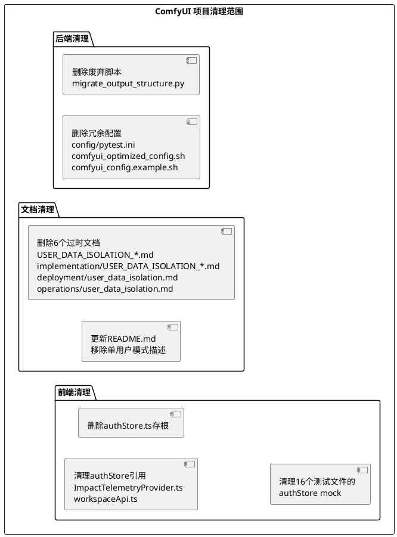

# **1. 实现模型**

## **1.1 上下文视图**

本次清理任务不涉及系统架构变更，仅对项目文件系统中的废弃内容进行删除和更新操作。清理范围限定在以下5个模块：



## **1.2 服务/组件总体架构**

本次清理不改变系统架构。清理操作按以下执行顺序进行，确保每一步可独立验证：

**阶段1：后端文件删除（无依赖关系，可并行）**
- 删除废弃脚本
- 删除冗余配置文件

**阶段2：文档清理（无依赖关系，可并行）**
- 删除过时文档
- 更新 docs/implementation/README.md 索引

**阶段3：前端存根清理（有依赖关系，需顺序执行）**
1. 修复 `ImpactTelemetryProvider.ts` — 移除 authStore 引用
2. 修复 `workspaceApi.ts` — 替换 authStore 调用为本地函数
3. 清理测试文件中的 authStore mock
4. 删除 `authStore.ts` 文件

**阶段4：README 更新（最后执行）**
- 更新 README.md 中的过时内容

## **1.3 实现设计文档**

### 1.3.1 废弃脚本删除

**目标文件**：`scripts/migrate_output_structure.py`

**实现方案**：直接删除文件。该脚本头部标记为 DEPRECATED，迁移路径为 `output/{user_id}/` -> `output/user_{user_id}/`，当前系统已使用 `user/{user_id}/output/` 结构。替代脚本 `migrate_user_asset_structure.py` 仍保留。

**验证方式**：确认 `scripts/migrate_user_asset_structure.py` 存在且功能正常。

### 1.3.2 冗余配置文件删除

**目标文件**：
| 文件 | 删除原因 |
|------|----------|
| `config/pytest.ini` | 与根目录 `pytest.ini` 内容完全相同，pytest 不会自动识别 config/ 下的配置 |
| `config/comfyui_optimized_config.sh` | 硬编码特定硬件（RTX 4070 Ti SUPER），与主配置重复，未被任何脚本引用 |
| `config/comfyui_config.example.sh` | 与 `comfyui_config.sh` 内容几乎相同，无参考价值，未被任何脚本引用 |

**实现方案**：直接删除三个文件。经搜索确认，这三个文件均未被项目中的任何脚本引用。

**保留文件**：`config/comfyui_config.sh` — 虽然也未被运行时脚本引用，但作为实际使用的配置参考保留。

### 1.3.3 过时文档删除

**目标文件**：
| 文件 | 删除原因 |
|------|----------|
| `docs/USER_DATA_ISOLATION_COMPLETE.md` | 描述过时目录结构 `output/user_0/`，当前已改为 `user/0/output/` |
| `docs/USER_DATA_ISOLATION_SUMMARY.md` | 被 COMPLETE 版覆盖，目录结构过时 |
| `docs/implementation/USER_DATA_ISOLATION_DESIGN.md` | 引用已废弃的 `args.multi_user`，标记"待实现"但已实现 |
| `docs/implementation/USER_DATA_ISOLATION_IMPLEMENTATION_REPORT.md` | 引用已废弃的 `args.multi_user`，目录结构过时 |
| `docs/deployment/user_data_isolation.md` | 引用不存在的脚本（`diagnose_user_data.py`、`fix_user_data.py` 等） |
| `docs/operations/user_data_isolation.md` | 引用不存在的脚本和模块，联系信息使用占位符 |

**实现方案**：直接删除6个文件。删除后需同步更新 `docs/implementation/README.md` 中的索引，移除对已删除文档的引用。

**保留文档**：
- `docs/MULTI_USER_SYSTEM.md` — 核心多用户系统技术文档，内容当前有效
- `docs/DATA_ISOLATION_DEVELOPER_GUIDE.md` — 数据隔离开发者指南，内容当前有效
- `docs/development/data_isolation_guide.md` — 开发规范有参考价值，保留但标记需更新

### 1.3.4 前端 authStore 存根清理

**步骤1：修复 ImpactTelemetryProvider.ts**

文件：`ComfyUI_frontend/src/platform/telemetry/providers/cloud/ImpactTelemetryProvider.ts`

当前代码（第113-118行）：
```typescript
if (stores.authStore.currentUser) {
  identity.uid = stores.authStore.currentUser.uid;
  identity.email = stores.authStore.currentUser.email;
}
```

问题：`authStore.currentUser` 在 stub 中不存在，运行时始终为 `undefined`，此分支为死代码。

修改方案：移除 `authStore` 导入和 `authStore.currentUser` 分支，`resolveCustomerIdentity()` 仅使用 `apiKeyAuthStore` 逻辑。因为本地部署场景下不存在云认证用户，`authStore` 分支永远不会执行。

**步骤2：修复 workspaceApi.ts**

文件：`ComfyUI_frontend/src/platform/workspace/api/workspaceApi.ts`

当前代码（第552行）：
```typescript
const authHeader = await useAuthStore().getFirebaseAuthHeaderOrThrow();
```

问题：`getFirebaseAuthHeaderOrThrow` 在 authStore stub 中不存在，调用将导致运行时错误。

修改方案：替换为本地 `getAuthHeaderOrThrow()` 函数（第341-343行已定义），与其他所有 API 方法保持一致。本地函数返回空对象 `{}`，在本地部署场景下是合理的 fallback。

**步骤3：清理测试文件中的 authStore mock**

16个测试文件中包含 `vi.mock('@/stores/authStore', ...)` 声明。由于被测代码将不再依赖 authStore，这些 mock 声明应移除。

涉及文件：
- `TopMenuSection.test.ts`
- `WorkflowTab.test.ts`
- `useCoreCommands.test.ts`
- `PricingTable.test.ts`
- `useSubscription.test.ts`
- `subscriptionCheckoutUtil.test.ts`
- `teamSubscriptionCheckoutUtil.test.ts`
- `ImpactTelemetryProvider.test.ts`
- `workspaceApi.test.ts`
- `WorkspaceAuthGate.test.ts`
- `useWorkspaceAuth.test.ts`
- `useSubscriptionCheckout.test.ts`
- `useRemoteWidget.test.ts`
- `app.test.ts`
- `bootstrapStore.test.ts`
- `GraphView.test.ts`

修改方案：移除每个测试文件中的 `vi.mock('@/stores/authStore', ...)` 声明及相关的 `useAuthStore` / `AuthStoreError` 导入。如果测试用例中直接使用了 authStore 的 mock 返回值，需同步移除或替换为 userStore mock。

**步骤4：删除 authStore.ts**

文件：`ComfyUI_frontend/src/stores/authStore.ts`

在步骤1-3完成后，确认无任何文件导入 authStore，然后删除该文件。

### 1.3.5 README.md 更新

文件：`README.md`

修改内容：

| 位置 | 当前内容 | 修改为 |
|------|----------|--------|
| 第1行 | `# ComfyUI 多用户版本` | `# ComfyUI` |
| 第10行 | `基于 ComfyUI 的多用户工作流管理系统` | `基于 ComfyUI 的 AI 图像/视频生成工作流管理系统` |
| 第16行 | `新增了**多用户系统**和**数据隔离**功能` | `内置**多用户系统**和**数据隔离**功能` |
| 第21行 | `多用户系统 - 支持多用户独立使用，数据完全隔离` | `用户系统 - 支持多用户独立使用，数据完全隔离` |
| 第70-72行 | `# 单用户模式` + 启动命令 | 删除这三行 |
| 第74行 | `# 多用户模式（推荐）` | `# 启动服务` |
| 第76行 | `python main.py --listen 0.0.0.0 --port 8188 --multi-user` | `python main.py --listen 0.0.0.0 --port 8188` |
| 第153-190行 | "多用户系统"独立章节 | 合并到快速开始章节，作为默认功能说明 |
| 第200行 | `# 启动服务（多用户模式）` | `# 启动服务` |

# **2. 接口设计**

## **2.1 总体设计**

本次清理不涉及接口变更。所有删除和修改操作不影响系统对外暴露的 API 接口。

## **2.2 接口清单**

无新增或修改的接口。

# **4. 数据模型**

## **4.1 设计目标**

本次清理不涉及数据模型变更。不删除任何数据库文件、迁移脚本或 ORM 模型。

## **4.2 模型实现**

无数据模型变更。
