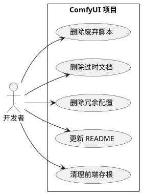
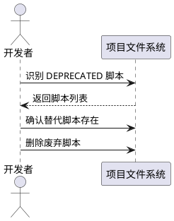
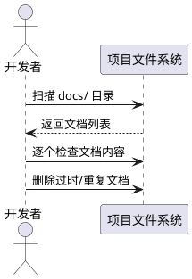
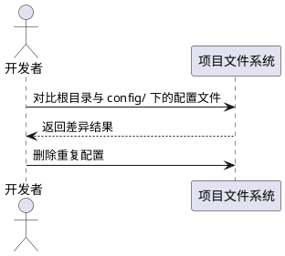
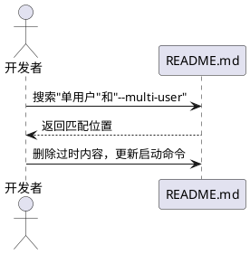
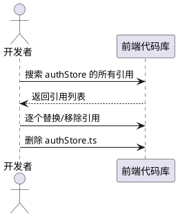

# **1. 组件定位**

## **1.1 核心职责**

本组件负责清理项目中旧版本遗留的废弃代码、过时文档和冗余配置文件，确保项目代码库仅保留多用户模式部署所需的内容。

## **1.2 核心输入**

1. 项目当前代码库中标记为 DEPRECATED 的脚本和代码
2. 引用已废弃参数（如 `--multi-user`、`args.multi_user`）的文档和代码
3. 内容重复或描述过时目录结构的文档
4. 与根目录配置完全重复的配置文件
5. 硬编码特定硬件且与实际配置重复的配置脚本
6. 云端认证功能已移除的前端存根代码

## **1.3 核心输出**

1. 删除废弃脚本、过时文档、冗余配置文件后的精简代码库
2. 更新后的 README.md（移除单用户模式描述和已废弃参数）
3. 清理后的前端代码（移除认证存根或其引用）
4. 更新后的项目结构分析文档

## **1.4 职责边界**

1. 不删除标记为 `is_deprecated = True` 的节点类代码（旧工作流仍需兼容）
2. 不删除 `_migrate_users_format()` 迁移方法（可能仍有旧部署实例依赖）
3. 不删除 `deprecation_warning` 中间件（对第三方自定义节点有运行时提示价值）
4. 不删除 `cli_args.py` 中关于 `--multi-user` 已移除的注释（有文档价值）
5. 不重写仍需保留的文档（仅删除明确过时的文档）
6. 不修改核心业务逻辑代码

# **2. 领域术语**

**多用户模式**
: 系统始终启用的运行模式，所有用户必须登录后才能访问系统功能和运行任务。

**单用户模式**
: 旧版本支持的运行模式，无需登录即可使用系统。当前版本已完全移除此模式。

**--multi-user 参数**
: 旧版本用于启用多用户模式的命令行参数。当前版本中此参数已被移除，多用户模式始终启用。

**用户数据隔离**
: 每个登录用户拥有独立的目录（output/input/temp/workflows）和数据库记录，用户之间数据不可互访。

**认证存根（Auth Store Stub）**
: 前端中为已移除的云端认证功能提供的空实现，所有方法返回 null 或抛出异常。

**DEPRECATED 标记**
: 代码或文档中标记为已废弃的标识，表示该功能已被替代，不应在新场景中使用。

# **3. 角色与边界**

## **3.1 核心角色**

开发者：执行代码清理操作，确保删除旧版本遗留内容后系统正常运行。

## **3.2 外部系统**

无外部系统交互。本组件为项目内部清理任务。

## **3.3 交互上下文**

# **4. DFX约束**

## **4.1 性能**

无特殊性能要求。清理操作为一次性任务，不影响系统运行时性能。

## **4.2 可靠性**

1. 删除操作必须可验证：每项删除后系统必须能正常启动和运行
2. 删除操作必须可回滚：所有删除的文件内容应通过 git 历史可恢复

## **4.3 安全性**

1. 禁止删除包含用户敏感数据的文件
2. 禁止删除数据库文件和迁移脚本

## **4.4 可维护性**

1. 删除文件后需验证项目可正常启动
2. 删除文件后需验证前端可正常构建

## **4.5 兼容性**

1. 已有工作流中使用的废弃节点类代码必须保留（`is_deprecated = True` 的节点）
2. 旧部署实例可能依赖的迁移代码必须保留（`_migrate_users_format()`）
3. 第三方自定义节点可能使用的旧 API 路径警告必须保留（`deprecation_warning` 中间件）

# **5. 核心能力**

## **5.1 废弃脚本清理**

### **5.1.1 业务规则**

1. **已废弃迁移脚本删除规则**：标记为 DEPRECATED 且有替代脚本的迁移脚本必须删除

   a. 验收条件：[存在 DEPRECATED 标记的迁移脚本且有替代脚本] → [删除该脚本]

2. **禁止删除规则**：无替代脚本的迁移代码不得删除

   a. 验收条件：[迁移代码无替代且仍有旧部署实例可能依赖] → [保留该代码]

### **5.1.2 交互流程**

### **5.1.3 异常场景**

1. **替代脚本不存在**

   a. 触发条件：DEPRECATED 脚本无对应替代脚本

   b. 系统行为：保留该脚本，添加 TODO 注释标记未来清理

   c. 用户感知：脚本保留，控制台无变化

## **5.2 过时文档清理**

### **5.2.1 业务规则**

1. **过时目录结构文档删除规则**：描述已废弃目录结构（如 `output/user_{id}/`）且无当前参考价值的文档必须删除

   a. 验收条件：[文档描述的目录结构与当前系统不一致] → [删除该文档]

2. **引用不存在脚本的文档删除规则**：引用不存在的脚本或模块的文档必须删除

   a. 验收条件：[文档引用的脚本文件不存在于项目中] → [删除该文档]

3. **重复文档删除规则**：内容被其他文档完全覆盖的文档必须删除

   a. 验收条件：[文档内容是另一文档的子集或早期版本] → [删除该文档]

4. **有参考价值文档保留规则**：包含开发规范等有持续参考价值的文档应当保留但需更新

   a. 验收条件：[文档包含开发规范或操作指南等持续参考内容] → [保留并标记需更新]

### **5.2.2 交互流程**

### **5.2.3 异常场景**

1. **文档部分内容仍有价值**

   a. 触发条件：文档大部分内容过时但包含少量有价值信息

   b. 系统行为：保留文档，标记需更新

   c. 用户感知：文档保留，后续需手动更新

## **5.3 冗余配置清理**

### **5.3.1 业务规则**

1. **重复配置文件删除规则**：与根目录配置完全相同的子目录配置文件必须删除

   a. 验收条件：[config/ 目录下的配置文件与根目录同名配置内容完全相同] → [删除 config/ 下的副本]

2. **硬编码特定硬件配置删除规则**：硬编码特定硬件参数且与实际使用配置重复的配置脚本必须删除

   a. 验收条件：[配置脚本硬编码特定硬件且与主配置重复] → [删除该配置脚本]

3. **示例配置与实际配置相同时删除规则**：example 配置文件与实际配置文件内容几乎相同时必须删除 example 文件

   a. 验收条件：[example 配置与实际配置内容一致] → [删除 example 文件]

### **5.3.2 交互流程**

### **5.3.3 异常场景**

1. **配置文件被其他脚本引用**

   a. 触发条件：待删除的配置文件被其他脚本通过路径引用

   b. 系统行为：保留该配置文件，更新引用指向根目录配置

   c. 用户感知：配置文件保留或引用路径更新

## **5.4 README 更新**

### **5.4.1 业务规则**

1. **单用户模式描述删除规则**：README 中关于"单用户模式"的描述和启动示例必须删除

   a. 验收条件：[README 包含"单用户模式"描述] → [删除该描述]

2. **已废弃参数删除规则**：README 中引用 `--multi-user` 参数的内容必须删除

   a. 验收条件：[README 包含 `--multi-user` 参数] → [删除该参数引用]

3. **启动命令更新规则**：启动命令必须简化为仅多用户模式（无需额外参数）

   a. 验收条件：[README 启动命令包含已废弃参数] → [更新为当前正确的启动命令]

### **5.4.2 交互流程**

### **5.4.3 异常场景**

无特殊异常场景。

## **5.5 前端认证存根清理**

### **5.5.1 业务规则**

1. **认证存根引用清理规则**：前端代码中引用 `useAuthStore` 或 `AuthStoreError` 的代码必须改为使用 `userStore` 或移除

   a. 验收条件：[前端代码导入 authStore] → [替换为 userStore 或移除相关逻辑]

2. **认证存根文件删除规则**：当所有引用清理完毕后，`authStore.ts` 文件必须删除

   a. 验收条件：[authStore.ts 无任何导入引用] → [删除 authStore.ts]

### **5.5.2 交互流程**

### **5.5.3 异常场景**

1. **引用无法简单替换**

   a. 触发条件：authStore 的某个方法在调用处有复杂逻辑依赖

   b. 系统行为：保留该引用，添加 TODO 注释标记未来清理

   c. 用户感知：代码保留，编译正常

# **6. 数据约束**

## **6.1 待删除文件清单**

1. **文件路径**：`scripts/migrate_output_structure.py` — DEPRECATED 标记，有替代脚本 `migrate_user_asset_structure.py`
2. **文件路径**：`config/pytest.ini` — 与根目录 `pytest.ini` 完全重复
3. **文件路径**：`config/comfyui_optimized_config.sh` — 硬编码特定硬件，与主配置重复
4. **文件路径**：`config/comfyui_config.example.sh` — 与实际配置几乎相同
5. **文件路径**：`docs/USER_DATA_ISOLATION_COMPLETE.md` — 描述过时目录结构
6. **文件路径**：`docs/USER_DATA_ISOLATION_SUMMARY.md` — 被 COMPLETE 版覆盖，目录结构过时
7. **文件路径**：`docs/implementation/USER_DATA_ISOLATION_DESIGN.md` — 引用已废弃参数，标记"待实现"但已实现
8. **文件路径**：`docs/implementation/USER_DATA_ISOLATION_IMPLEMENTATION_REPORT.md` — 引用已废弃参数，目录结构过时
9. **文件路径**：`docs/deployment/user_data_isolation.md` — 引用不存在的脚本
10. **文件路径**：`docs/operations/user_data_isolation.md` — 引用不存在的脚本和模块
11. **文件路径**：`ComfyUI_frontend/src/stores/authStore.ts` — 云端认证存根（需先清理引用）

## **6.2 待更新文件清单**

1. **文件路径**：`README.md` — 移除单用户模式描述和 `--multi-user` 参数引用
2. **文件路径**：`docs/development/data_isolation_guide.md` — 保留但需更新代码示例
3. **文件路径**：`PROJECT_STRUCTURE_ANALYSIS.md` — 保留但需更新版本号和删除已移除目录条目

## **6.3 保留不动的文件**

1. **文件路径**：`app/user_manager.py` 中的 `_migrate_users_format()` — 旧部署实例可能依赖
2. **文件路径**：`server/__init__.py` 中的 `deprecation_warning` 中间件 — 第三方节点运行时提示
3. **文件路径**：`comfy/cli_args.py` 中的 `--multi-user` 注释 — 文档价值
4. **文件路径**：`comfy_extras/nodes_dataset.py` 中的废弃节点类 — 旧工作流兼容
