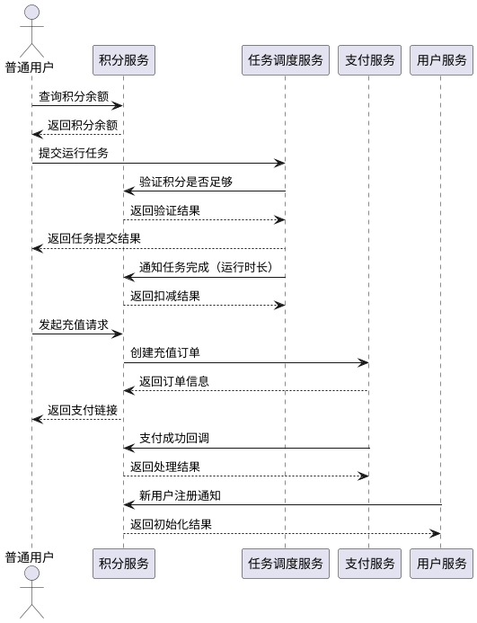
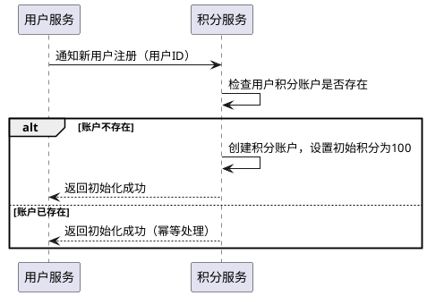
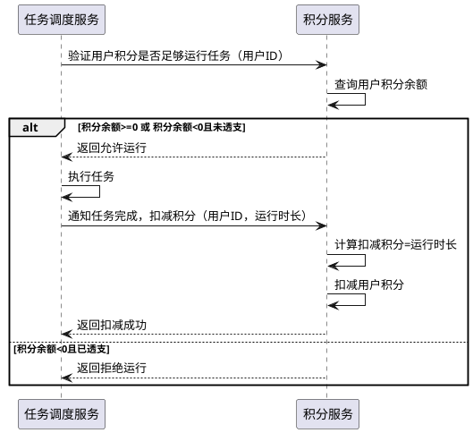
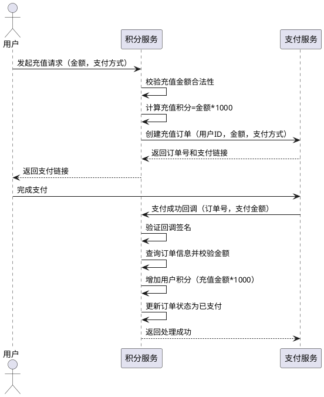
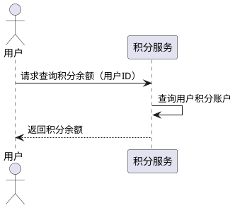

cd# **1. 组件定位**

## **1.1 核心职责**

本组件负责管理用户的积分账户，实现积分的消耗、充值和透支控制，支持任务运行时的积分扣减和用户充值获取积分。

## **1.2 核心输入**

1. 用户任务运行请求：包含任务运行时长信息
2. 用户充值请求：包含充值金额和支付方式
3. 支付平台回调：支付宝/微信支付成功通知

## **1.3 核心输出**

1. 积分扣减结果：返回扣减后的积分余额和任务运行权限
2. 充值订单信息：返回订单号、支付链接等信息
3. 积分余额查询结果：返回当前用户的积分余额

## **1.4 职责边界**

本组件不负责：
1. 任务的实际执行和调度
2. 支付渠道的具体对接实现（由支付服务负责）
3. 用户账户的创建和认证（由用户服务负责）
4. 积分兑换商品或服务的业务逻辑

# **2. 领域术语**

**积分**
: 用户在系统中可用于运行任务的虚拟货币单位，通过充值获取，运行任务时消耗。

**积分余额**
: 用户当前账户中可用的积分数量，可以为负数（透支状态）。

**透支**
: 用户在积分不足时仍可运行任务，导致积分余额为负数的行为。

**充值**
: 用户通过支付人民币兑换积分的行为，兑换比例为1人民币=1000积分。

**任务运行时长**
: 用户任务实际运行的秒数，用于计算需要扣除的积分数。

**透支额度**
: 用户允许透支的积分上限，本系统中为单次任务运行所需的最大积分。

# **3. 角色与边界**

## **3.1 核心角色**

- **普通用户**：使用积分运行任务，通过充值获取积分

## **3.2 外部系统**

- **任务调度服务**：调用积分服务验证用户积分是否足够运行任务，并在任务完成后通知扣减积分
- **支付服务**：处理用户的充值支付请求，接收支付宝/微信的支付回调
- **用户服务**：提供用户基本信息，用于积分账户的初始化

## **3.3 交互上下文**

# **4. DFX约束**

## **4.1 性能**

- 积分扣减接口响应时间不超过100ms
- 积分查询接口响应时间不超过50ms
- 充值订单创建接口响应时间不超过200ms

## **4.2 可靠性**

- 积分扣减操作必须保证原子性，不允许出现积分扣减失败但任务已执行的情况
- 支付回调处理必须保证幂等性，重复回调不会重复增加积分
- 系统可用性目标：99.9%

## **4.3 安全性**

- 积分扣减接口必须验证调用方身份，防止恶意调用
- 充值金额必须进行参数校验，防止负数或异常金额
- 支付回调必须验证签名，防止伪造回调

## **4.4 可维护性**

- 积分变动必须记录审计日志，包括变动原因、变动金额、变动后余额
- 关键接口（扣减、充值）必须接入监控告警
- 日志必须包含用户ID、操作类型、变动金额等关键信息

## **4.5 兼容性**

- 充值比例变更需要支持配置化，1人民币=1000积分为默认值
- 透支规则变更需要支持配置化

# **5. 核心能力**

## **5.1 积分账户初始化**

### **5.1.1 业务规则**

1. **初始化规则**：新用户注册时，系统必须为用户创建积分账户并初始化100积分
   a. 验收条件：[用户服务通知新用户注册] → [积分服务创建积分账户并设置初始积分为100]

2. **禁止重复初始化**：禁止为已存在积分账户的用户重复初始化
   a. 验收条件：[用户服务重复通知同一用户注册] → [积分服务拒绝重复初始化并返回成功]

### **5.1.2 交互流程**

### **5.1.3 异常场景**

1. **用户服务调用失败**
   a. 触发条件：[用户服务调用积分服务超时或网络异常]
   b. 系统行为：[积分服务记录错误日志，用户服务进行重试]
   c. 用户感知：[无感知，用户注册流程继续]

## **5.2 任务运行积分扣减**

### **5.2.1 业务规则**

1. **积分验证规则**：用户提交任务前，系统必须验证用户积分是否足够运行任务
   a. 验收条件：[用户积分余额>=0或用户积分余额<0且未处于透支状态] → [允许运行任务]
   b. 验收条件：[用户积分余额<0且已处于透支状态] → [拒绝运行任务]

2. **积分扣减规则**：任务完成后，系统必须根据任务实际运行时长扣减对应积分，1秒扣减1积分
   a. 验收条件：[任务运行N秒] → [扣减N积分]

3. **透支控制规则**：用户积分可以为负数，但最多只能透支一次，已透支的用户不能再运行任务
   a. 验收条件：[用户积分余额>=0] → [允许运行任务并扣减积分，积分可能变为负数]
   b. 验收条件：[用户积分余额<0] → [拒绝运行任务]

4. **禁止项**：禁止在积分扣减失败时允许任务继续运行
   a. 验收条件：[积分扣减操作失败] → [任务标记为失败，不允许继续执行]

### **5.2.2 交互流程**

### **5.2.3 异常场景**

1. **积分余额查询失败**
   a. 触发条件：[积分服务数据库异常或网络超时]
   b. 系统行为：[积分服务返回错误，任务调度服务拒绝任务运行]
   c. 用户感知：[提示"积分服务异常，请稍后重试"']

2. **积分扣减失败**
   a. 触发条件：[积分服务数据库异常或并发冲突]
   b. 系统行为：[积分服务返回错误，任务调度服务标记任务为失败]
   c. 用户感知：[提示"积分扣减失败，任务已终止"]

3. **任务运行时长为0或负数**
   a. 触发条件：[任务调度服务传入的运行时长<=0]
   b. 系统行为：[积分服务拒绝扣减，返回参数错误]
   c. 用户感知：[任务调度服务记录错误日志]

## **5.3 积分充值**

### **5.3.1 业务规则**

1. **充值比例规则**：用户充值时，系统必须按照1人民币=1000积分的比例计算充值积分
   a. 验收条件：[用户充值N人民币] → [增加N*1000积分]

2. **支付方式规则**：系统必须支持支付宝和微信两种支付方式
   a. 验收条件：[用户选择支付宝支付] → [生成支付宝支付订单]
   b. 验收条件：[用户选择微信支付] → [生成微信支付订单]

3. **充值到账规则**：支付成功后，系统必须立即将积分增加到用户账户
   a. 验收条件：[收到支付成功回调] → [用户积分余额增加充值金额*1000]

4. **禁止项**：禁止充值金额为负数或0
   a. 验收条件：[用户充值金额<=0] → [拒绝充值请求并返回参数错误]

### **5.3.2 交互流程**

### **5.3.3 异常场景**

1. **充值金额参数错误**
   a. 触发条件：[用户传入的充值金额<=0或非数字]
   b. 系统行为：[积分服务拒绝请求，返回参数错误]
   c. 用户感知：[提示"充值金额必须大于0"]

2. **支付服务调用失败**
   a. 触发条件：[支付服务超时或返回错误]
   b. 系统行为：[积分服务返回错误，充值流程终止]
   c. 用户感知：[提示"支付服务异常，请稍后重试"]

3. **支付回调签名验证失败**
   a. 触发条件：[支付回调的签名不正确]
   b. 系统行为：[积分服务拒绝处理回调，返回签名错误]
   c. 用户感知：[无感知，支付服务会重试回调]

4. **支付回调金额与订单金额不匹配**
   a. 触发条件：[回调的支付金额与订单金额不一致]
   b. 系统行为：[积分服务拒绝处理回调，记录异常日志]
   c. 用户感知：[无感知，需要人工介入处理]

5. **重复支付回调**
   a. 触发条件：[收到同一订单的重复支付回调]
   b. 系统行为：[积分服务检查订单状态，已支付的订单直接返回成功]
   c. 用户感知：[无感知]

## **5.4 积分余额查询**

### **5.4.1 业务规则**

1. **查询规则**：用户查询积分余额时，系统必须返回当前用户的积分余额
   a. 验收条件：[用户请求查询积分] → [返回用户当前积分余额]

### **5.4.2 交互流程**

### **5.4.3 异常场景**

1. **用户积分账户不存在**
   a. 触发条件：[查询的用户ID对应的积分账户不存在]
   b. 系统行为：[积分服务返回积分余额为0]
   c. 用户感知：[显示积分为0]

# **6. 数据约束**

## **6.1 积分账户**

1. **用户ID**：唯一标识一个用户，必须存在且不为空
2. **积分余额**：用户当前可用的积分数量，可以为负数，初始值为100
3. **账户状态**：标识账户是否正常，包括正常、冻结等状态
4. **创建时间**：积分账户创建的时间戳
5. **更新时间**：积分账户最后更新的时间戳

## **6.2 充值订单**

1. **订单号**：唯一标识一个充值订单，必须全局唯一
2. **用户ID**：充值用户的标识，必须存在且不为空
3. **充值金额**：用户充值的金额，单位为人民币，必须大于0
4. **充值积分**：充值金额对应的积分数，必须等于充值金额*1000
5. **支付方式**：支付渠道，包括支付宝、微信
6. **订单状态**：订单的当前状态，包括待支付、已支付、已取消、已退款
7. **创建时间**：订单创建的时间戳
8. **支付时间**：订单支付完成的时间戳
