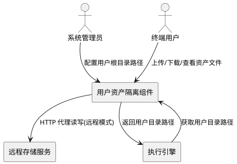
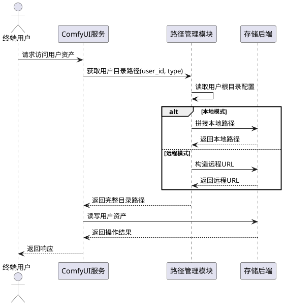
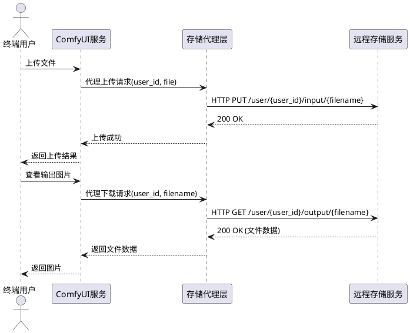
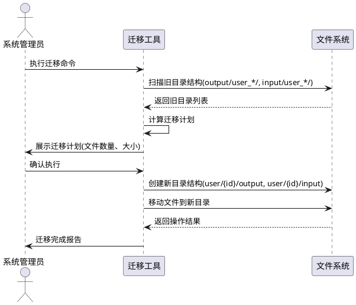

# **1. 组件定位**

## **1.1 核心职责**

本组件负责重构用户资产目录隔离结构，将用户资产从"在 output/input 下创建用户子目录"改为"在 user/{user_id} 下创建 output/input 子目录"，并支持用户根目录的可配置化（本地路径或远程 HTTP 地址）。

## **1.2 核心输入**

1. 用户操作请求：用户上传图片、保存生成结果、查看输入文件列表等操作
2. 系统配置：用户根目录路径配置（本地路径如 `user/` 或远程地址如 `http://192.168.50.228:8188/user/`）
3. 执行上下文：当前请求关联的 user_id（来自 HTTP 请求 header/cookie）

## **1.3 核心输出**

1. 用户资产文件：按新目录结构组织的用户输入/输出文件
2. 目录路径响应：API 返回的用户专属目录路径
3. 文件访问服务：对用户资产的读写能力（本地直接访问或远程 HTTP 代理访问）

## **1.4 职责边界**

1. 不负责用户认证与鉴权（由现有 AuthService 和 UserIsolationMiddleware 处理）
2. 不负责数据库级数据隔离（由现有 IsolationRepository 处理）
3. 不负责模型文件管理（模型路径不受本次重构影响）
4. 不负责前端 UI 变更（前端适配由其他组件负责）
5. 不负责远程存储服务的部署与运维（仅提供客户端访问能力）

# **2. 领域术语**

**用户根目录（User Root Directory）**
: 所有用户资产的顶层目录，可以是本地文件系统路径或远程 HTTP 服务地址，是本次重构新增的可配置项。

**用户资产目录（User Asset Directory）**
: 单个用户的完整资产目录，结构为 `{user_root}/{user_id}/`，包含 output、input、temp 等子目录。

**本地模式（Local Mode）**
: 用户根目录指向本地文件系统路径的模式，程序直接通过文件系统 API 读写用户资产。

**远程模式（Remote Mode）**
: 用户根目录指向远程 HTTP 服务地址的模式，程序通过 HTTP 请求代理读写用户资产。

**新目录结构（New Directory Structure）**
: 重构后的目录结构，即 `user/{user_id}/output/`、`user/{user_id}/input/`、`user/{user_id}/temp/`。

# **3. 角色与边界**

## **3.1 核心角色**

- **系统管理员**：配置用户根目录路径（本地或远程），决定资产存储策略
- **终端用户**：通过 ComfyUI 界面上传图片、查看生成结果、管理工作流

## **3.2 外部系统**

- **远程存储服务**：当用户根目录配置为 HTTP 地址时，提供文件存储和访问能力的远端服务
- **执行引擎**：调用 folder_paths 获取输出/输入目录路径，执行工作流节点

## **3.3 交互上下文**

# **4. DFX约束**

## **4.1 性能**

1. 本地模式下，目录路径解析必须在 1ms 内完成
2. 远程模式下，单次文件读写操作超时上限为 30 秒
3. 目录路径解析不得引入额外的网络 I/O（本地模式）

## **4.2 可靠性**

1. 远程模式下，HTTP 请求必须支持重试机制（至少 3 次重试）
2. 配置切换（本地/远程）后，系统必须能正常启动，不因旧目录结构缺失而崩溃
3. 用户根目录配置无效时，系统必须给出明确的错误提示并拒绝启动

## **4.3 安全性**

1. 远程模式下，必须验证 HTTP 响应来源，防止重定向攻击
2. 路径遍历防护必须继续有效，用户不能通过构造路径访问其他用户的资产
3. 远程模式的 HTTP 地址必须支持 HTTPS

## **4.4 可维护性**

1. 用户根目录配置必须通过配置文件或命令行参数指定，禁止硬编码
2. 目录路径生成逻辑必须集中管理，不得散落在多个模块中
3. 必须提供目录结构迁移工具，支持从旧结构迁移到新结构

## **4.5 兼容性**

1. 必须提供旧目录结构到新目录结构的迁移方案
2. API 接口（上传、查看、下载）的行为和返回格式必须保持不变
3. 节点（SaveImage、LoadImage 等）的使用方式必须保持不变

# **5. 核心能力**

## **5.1 用户资产目录重构**

### **5.1.1 业务规则**

1. **新目录结构规则**：用户的 output、input、temp 目录必须位于用户根目录下的用户专属子目录中
   - 验收条件：[用户1请求输出目录] → [返回 `{user_root}/1/output/`]

2. **用户根目录可配置规则**：用户根目录必须支持通过配置文件或命令行参数指定
   - 验收条件：[配置 `--user-directory /data/users`] → [用户1的输出目录为 `/data/users/1/output/`]
   - 验收条件：[配置 `--user-directory http://192.168.50.228:8188/user`] → [用户1的输出目录为 `http://192.168.50.228:8188/user/1/output/`]

3. **本地模式默认值规则**：未配置用户根目录时，默认使用本地 `{base_path}/user/` 路径
   - 验收条件：[未指定 `--user-directory`] → [用户1的输出目录为 `{base_path}/user/1/output/`]

4. **目录自动创建规则**：本地模式下，访问用户目录时必须自动创建不存在的子目录
   - 验收条件：[首次访问用户1的输出目录] → [自动创建 `{user_root}/1/output/` 及所有父目录]

5. **禁止项**：禁止在代码中硬编码任何目录路径
   - 验收条件：[代码审查] → [所有目录路径均通过配置或函数调用获取]

### **5.1.2 交互流程**

### **5.1.3 异常场景**

1. **用户根目录配置无效**
   - 触发条件：配置的本地路径不存在或无读写权限
   - 系统行为：启动时检测并记录错误日志
   - 用户感知：系统拒绝启动，控制台输出明确的配置错误提示

2. **远程存储服务不可达**
   - 触发条件：配置的 HTTP 地址无法连接
   - 系统行为：重试请求（最多3次），记录错误日志
   - 用户感知：文件操作失败，返回服务不可用错误码

3. **旧目录结构数据存在**
   - 触发条件：系统中存在 `output/user_{id}/` 或 `input/user_{id}/` 格式的旧数据
   - 系统行为：提示管理员运行迁移工具
   - 用户感知：不影响正常使用，管理员收到迁移提示

## **5.2 远程存储代理访问**

### **5.2.1 业务规则**

1. **远程模式识别规则**：当用户根目录以 `http://` 或 `https://` 开头时，必须启用远程模式
   - 验收条件：[配置 `--user-directory http://192.168.50.228:8188/user`] → [系统自动启用远程模式]

2. **文件上传代理规则**：远程模式下，文件上传必须通过 HTTP 请求转发到远程存储服务
   - 验收条件：[用户上传图片到 input 目录] → [系统将文件通过 HTTP PUT/POST 转发到远程存储]

3. **文件下载代理规则**：远程模式下，文件查看/下载必须通过 HTTP 请求从远程存储服务获取
   - 验收条件：[用户查看输出图片] → [系统从远程存储 HTTP GET 获取图片数据并返回]

4. **文件列表代理规则**：远程模式下，目录文件列表必须通过 HTTP 请求从远程存储服务获取
   - 验收条件：[LoadImage 节点列出输入文件] → [系统从远程存储 HTTP GET 获取文件列表]

5. **禁止项**：远程模式下禁止直接使用本地文件系统 API 操作远程路径
   - 验收条件：[代码审查] → [远程模式下所有文件操作均通过 HTTP 代理层]

### **5.2.2 交互流程**

### **5.2.3 异常场景**

1. **远程存储认证失败**
   - 触发条件：远程存储服务要求认证但未提供有效凭证
   - 系统行为：记录错误日志，返回认证失败
   - 用户感知：文件操作失败，提示认证错误

2. **远程存储响应超时**
   - 触发条件：HTTP 请求超过 30 秒未响应
   - 系统行为：取消请求，重试最多 3 次
   - 用户感知：文件操作延迟或失败

3. **大文件传输中断**
   - 触发条件：上传/下载过程中网络中断
   - 系统行为：记录中断位置，支持断点续传（如远程存储支持）
   - 用户感知：文件操作失败，需重试

## **5.3 目录结构迁移**

### **5.3.1 业务规则**

1. **迁移方向规则**：迁移必须从旧结构（`output/user_{id}/`）迁移到新结构（`user/{id}/output/`）
   - 验收条件：[执行迁移工具] → [旧目录 `output/user_1/images/` 的文件移动到 `user/1/output/images/`]

2. **迁移完整性规则**：迁移必须保证所有用户数据完整迁移，不丢失任何文件
   - 验收条件：[迁移前后文件数量和内容一致] → [迁移成功]

3. **迁移幂等性规则**：重复执行迁移工具必须不会导致数据丢失或重复
   - 验收条件：[对已迁移的目录再次执行迁移] → [跳过已迁移的文件，不产生重复]

4. **迁移可回滚规则**：迁移失败时必须能回滚到迁移前状态
   - 验收条件：[迁移过程中断] → [执行回滚后数据恢复到迁移前状态]

### **5.3.2 交互流程**

### **5.3.3 异常场景**

1. **磁盘空间不足**
   - 触发条件：目标目录所在磁盘空间不足以容纳迁移数据
   - 系统行为：迁移前检查磁盘空间，空间不足时拒绝迁移
   - 用户感知：迁移工具提示磁盘空间不足

2. **文件被占用**
   - 触发条件：迁移过程中文件被其他进程占用
   - 系统行为：跳过被占用文件，记录到迁移报告
   - 用户感知：迁移报告中列出被跳过的文件

# **6. 数据约束**

## **6.1 用户根目录配置**

1. **路径值**：必须为非空字符串，支持本地绝对路径或 HTTP/HTTPS URL
2. **本地路径格式**：必须为操作系统合法的绝对路径（如 `/data/users`、`C:\Users\data`）
3. **远程路径格式**：必须为合法的 HTTP/HTTPS URL（如 `http://192.168.50.228:8188/user`）
4. **默认值**：未配置时默认为 `{base_path}/user/`

## **6.2 用户资产目录路径**

1. **用户输出目录**：格式为 `{user_root}/{user_id}/output/`
2. **用户输入目录**：格式为 `{user_root}/{user_id}/input/`
3. **用户临时目录**：格式为 `{user_root}/{user_id}/temp/`
4. **用户数据目录**：格式为 `{user_root}/{user_id}/`（包含 workflows、prompts 等子目录）
5. **user_id**：必须为非空字符串，禁止以 `__` 前缀开头（系统用户保护）
